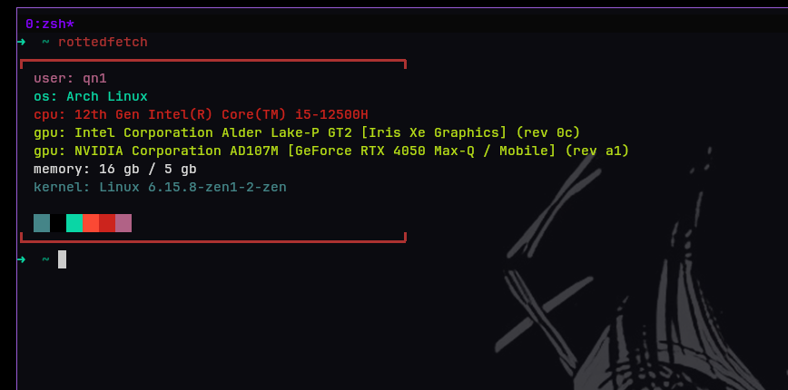

Minimalistic system fetch. Configuration is done by editing the **Config.toml** file.  
By default program reads the one defined locally, or the one under the **~/.config/rottedfetch/Config.toml**.    
  
### PREREQUISITES
---
+ cargo  
+ rustc  

### INSTALLATION

  

---
#### Arch Linux  

Users of Arch Linux may download the package from the AUR [rottedfetch](https://aur.archlinux.org/packages/rottedfetch) repository.

#### Compiling from source  

Everyone else should clone the source code and compile with the Rust compiler.  

```bash
$ cd rottedfetch  
$ cargo install --path .  
```

Happy usage!~